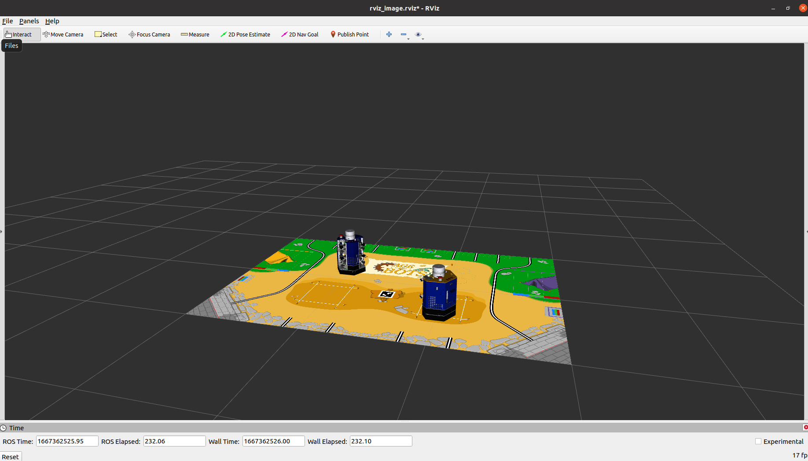
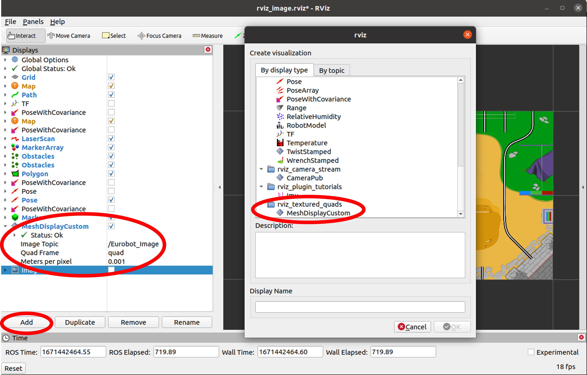

# Rviz Display


#### Rviz show Image and RobotModel.


#### [Image]
install rviz plugin (required) and compile
```
git clone https://github.com/lucasw/rviz_textured_quads.git
git clone https://github.com/lucasw/rviz_camera_stream.git
```


**NOTICE** : **Image Topic** under MeshDisplayCustom needs to correctly type in.

#### [RUN]
```
roslaunch rviz_display map_image.launch
roslaunch rviz_display rviz_robot.launch
```

● **map_image.launch** : open rviz, and show image on it.

● **rviz_robot.launch** : robot urdf, and a node that subscribe robot pose.
